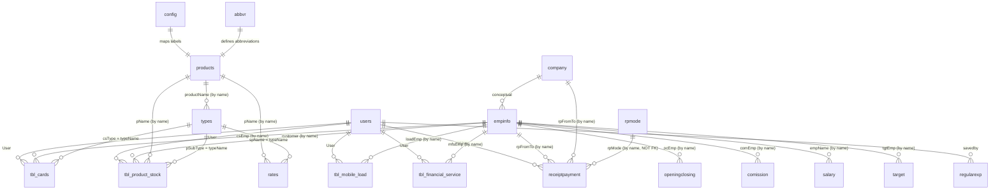

# NadirCom7726 — Complete Database Analysis

> **Source:** `nadircom7726.sql` (36,477 lines, 3.7 MB)
> **Server:** MariaDB 10.3.39 · **Charset:** latin1 · **Engine:** InnoDB (all tables)
> **Analyzed:** 2026-02-12

---

## 1. High-Level Overview

The database powers a **Jazz (Mobilink) telecom franchise management system** in Multan, Pakistan. It tracks the full lifecycle of a franchise operation:

1. **Procurement** — Purchasing mobile load (Otar), MFS credit (JazzCash), scratch cards, SIMs, and mobile devices from Mobilink
2. **Distribution** — Sending inventory to Distribution Officers (DOs) who sell to retailers
3. **Financials** — Receipts, payments, commissions, taxes, salaries, expenses, investments
4. **Reporting** — Monthly opening/closing balances, targets, stock calculations

### Data Volume (from AUTO_INCREMENT values)

| Table | Records (approx) | Notes |
|---|---|---|
| `receiptpayment` | ~14,154 | Highest volume — all financial movements |
| `tbl_mobile_load` | ~8,626 | Daily load transfers to 30+ DOs |
| `tbl_financial_service` | ~6,095 | MFS (JazzCash) credit distributions |
| `tbl_product_stock` | ~4,565 | SIM and device stock movements |
| `regularexp` | ~1,501 | Daily expenses |
| `openingclosing` | ~1,236 | Monthly balance snapshots |
| `comission` | ~560 | MFS commission records |
| `investment` | ~171 | Investment/withdrawal log |
| `tbl_cards` | ~151 | Scratch card transactions |
| `empinfo` | ~49 | Employees/DOs |
| `rates` | ~36 | Purchase/sale prices |
| `types` | ~34 | Product sub-types |
| `dueexp` | ~27 | Pending expense dues |
| `config` | 9 | System config |
| `products` | 5 | Product categories |
| `users` | 4 | Login accounts |
| `company` | 3 | Company records |
| `abbvr` | 13 | Abbreviation lookups |
| `rpmode` | 2 | Payment modes |
| `fixedexp` | 1 | Fixed expenses template |
| `salary`, `target`, `tax`, `petty`, `retailers`, `mfstransactions` | 0 (empty) | Defined but unused |

---

## 2. Table-by-Table Schema Analysis

### 2.1 `abbvr` — Abbreviation Lookup

| Column | Type | Default | PK | Notes |
|---|---|---|---|---|
| `ID` | int(11) | NOT NULL | ✅ AI | |
| `type` | varchar(20) | NULL | | Category: Pro, Emp, Sk, Co, Mix |
| `Abbvr` | varchar(10) | NULL | | Abbreviation code |
| `Description` | varchar(100) | NULL | | Full description |

**Purpose:** Reference table mapping abbreviations to descriptions (e.g., "Otar" → "Mobile Load", "DO" → "Distribution Officer").

**Issues:**
- 🟡 Mixed case column names (`ID`, `Abbvr`, `Description`)
- 🟡 No UNIQUE constraint on `Abbvr` — duplicates possible
- 🟢 Small static table, low risk

---

### 2.2 `comission` — Commission Records

| Column | Type | Default | PK | Notes |
|---|---|---|---|---|
| `comID` | int(11) | NOT NULL | ✅ AI | |
| `comDate` | date | NULL | | Commission date |
| `rp` | varchar(20) | NULL | | Always "Received" in data |
| `comType` | varchar(30) | NULL | | Always "MFS Comission" in data |
| `comEmp` | varchar(30) | NULL | | Always "Mobilink" in data |
| `comAmnt` | float | NULL | | Commission amount |
| `comComments` | varchar(100) | NULL | | Freetext note |

**Purpose:** Tracks commission income from Mobilink (MFS commissions received daily/bundled for weekends).

**Issues:**
- 🔴 `float` for monetary amounts — **precision loss** (e.g., 11956 stored as 11956.0 OK, but sub-rupee amounts will drift)
- 🔴 "Comission" is misspelled (should be "Commission") — embedded in column names and data
- 🟠 `rp` and `comType` are redundant — all 560 records have identical values ("Received", "MFS Comission")
- 🟠 No index on `comDate` — every date-range query does a full table scan
- 🟠 `comEmp` stores employee name as string instead of FK to `empinfo`

---

### 2.3 `company` — Company/Bank Registry

| Column | Type | Default | PK | Notes |
|---|---|---|---|---|
| `ID` | int(11) | NOT NULL | ✅ AI | |
| `Name` | varchar(30) | NULL | | Company name |
| `Type` | varchar(30) | NULL | | "CO" or "BNK" |
| `Comments` | varchar(50) | NOT NULL | | Always empty string |

**Purpose:** Stores company and bank names used throughout the system.

**Data:** Only 3 records: Mobilink (CO), Franchise (CO), Bank (BNK).

**Issues:**
- 🟡 `Comments` default is NOT NULL with empty string, but other tables use NULL — inconsistent
- 🟡 Only 3 records — could be a config entry instead of a table

---

### 2.4 `config` — System Configuration

| Column | Type | Default | PK | Notes |
|---|---|---|---|---|
| `id` | int(11) | NOT NULL | ✅ AI | |
| `name` | varchar(50) | NULL | | Config key |
| `customName` | varchar(100) | NULL | | Config value |

**Purpose:** Key-value configuration store (company name, default bank, product labels).

**Data:** 9 entries mapping concepts like "mobLoad" → "Otar", "finalcialService" → "JazzCash".

**Issues:**
- 🟡 Typo in data: "finalcialService" (should be "financialService")
- 🟡 No UNIQUE constraint on `name` — duplicates possible

---

### 2.5 `dueexp` — Pending Expense Dues

| Column | Type | Default | PK | Notes |
|---|---|---|---|---|
| `id` | int(11) | NOT NULL | ✅ AI | |
| `expMonth` | varchar(20) | NULL | | Month label (e.g., "Nov-2023") |
| `expDate` | date | NULL | | Expense date |
| `type` | varchar(30) | NULL | | Always "expense" |
| `description` | varchar(100) | NULL | | Expense description |
| `amnt` | int(11) | NULL | | Amount in PKR |
| `status` | varchar(50) | NULL | | Always "Pending" |

**Purpose:** Tracks recurring unpaid expenses (all 27 records are "Software Payment" at Rs.2000/month).

**Issues:**
- 🟡 `type` is always "expense" — redundant column
- 🟡 `status` is always "Pending" — no workflow to mark as paid
- 🟡 `expMonth` as varchar duplicates info already in `expDate`
- 🟡 Duplicate record: Aug-2024 appears twice (IDs 10 and 11)

---

### 2.6 `empinfo` — Employee Information

| Column | Type | Default | PK | Notes |
|---|---|---|---|---|
| `EmpID` | int(11) | NOT NULL | ✅ AI | |
| `EmpName` | varchar(30) | NULL | | Short name (e.g., "DO Kamran") — **used as FK everywhere** |
| `EmpJoinDate` | date | NULL | | Date of joining |
| `EmpFixedSalary` | int(11) | NULL | | Fixed salary (always 0 in data) |
| `EmpStatus` | varchar(20) | NULL | | "Active" or "Left" |
| `empType` | varchar(10) | NULL | | "DO", "SP", "Other", "Acct" |
| `Comments` | varchar(100) | NULL | | Status notes |
| `sort_order` | int(11) | NULL | | Display order |
| `showIn` | tinyint(4) | NULL | | Display flag (0, 2, 3) |
| `otcomrate` | float | NULL | | Otar commission rate (e.g., 0.0015) |
| `completeName` | varchar(50) | NULL | | Full legal name |
| `contactNo` | varchar(20) | NULL | | Phone number |
| `empAddress` | varchar(200) | NULL | | Address |
| `doLine` | varchar(20) | NULL | | DO line phone number |
| `cnic` | varchar(15) | NULL | | National ID (CNIC) |

**Purpose:** Central employee registry. Contains ~49 records including DOs, special accounts ("DueSalary", "DueProfit", "Cash Sale", "Retailer Account", "Fine Deduction"), and franchise owners.

**Issues:**
- 🔴 **`EmpName` is used as a foreign key throughout the entire database** — but it's a varchar with no UNIQUE constraint. If an employee name changes, ALL related records in 10+ tables become orphaned
- 🔴 CNIC values have inconsistent formats: some are "3630259176491", some are "36302-4827289-9", some are placeholder "1234567891234"
- 🟠 `EmpFixedSalary` is always 0 — salary info might be elsewhere or unused
- 🟠 `showIn` uses magic numbers (0, 2, 3) with no documentation
- 🟠 Non-employee records mixed in (DueSalary, DueProfit, Cash Sale, Fine Deduction)
- 🟠 `empType` inconsistently cased column name vs `EmpName`, `EmpStatus`

---

### 2.7 `fixedexp` — Fixed Expenses Template

| Column | Type | Default | PK | Notes |
|---|---|---|---|---|
| `id` | int(11) | NOT NULL | ✅ AI | |
| `expDate` | date | NULL | | Template date |
| `type` | varchar(30) | NULL | | "expense" |
| `description` | varchar(100) | NULL | | Expense description |
| `amnt` | int(11) | NULL | | Amount |

**Purpose:** Template for fixed monthly expenses. Only 1 record exists (Software Payment Rs.2000).

**Issues:**
- 🟡 Nearly identical structure to `dueexp` — merge candidate
- 🟡 Only 1 record — questionable need for a separate table

---

### 2.8 `investment` — Investment & Withdrawal Log

| Column | Type | Default | PK | Notes |
|---|---|---|---|---|
| `id` | int(11) | NOT NULL | ✅ AI | |
| `date` | date | NULL | | Transaction date |
| `type` | varchar(30) | NULL | | "Invest" or "Withdraw" |
| `amnt` | int(11) | NULL | | Amount in PKR |
| `comments` | varchar(100) | NULL | | Description |

**Purpose:** Tracks capital injections ("Invest") and withdrawals ("Withdraw") by franchise owners. ~171 records with amounts ranging from Rs.999 to Rs.2,800,000.

**Issues:**
- 🟡 `int(11)` for amounts — adequate for PKR but no decimal support
- 🟡 No reference to who made the investment (just freetext in comments like "Fahad Sb")
- 🟡 No index on `date` for date-range queries

---

### 2.9 `mfstransactions` — MFS Transaction Import (EMPTY)

| Column | Type | Default | PK | Notes |
|---|---|---|---|---|
| `mfstrid` | int(11) | NOT NULL | ✅ AI | |
| `trid` | varchar(20) | NULL | | Transaction ID |
| `orgmsisdn` | varchar(20) | NULL | | Originator MSISDN |
| `orgname` | varchar(100) | NULL | | Originator name |
| `balbeforetr` | float | NULL | | Balance before |
| `tramnt` | float | NULL | | Transaction amount |
| `balaftertr` | float | NULL | | Balance after |
| `trtime` | varchar(30) | NULL | | Transaction time (stored as VARCHAR) |
| `trtype` | varchar(20) | NULL | | Transaction type |
| `doname` | varchar(30) | NULL | | DO name |
| `addstatus` | varchar(20) | NULL | | Add status |
| `recorddate` | varchar(20) | "Not Recorded" | | Record date (stored as VARCHAR) |
| `addedby` | varchar(30) | NULL | | Added by user |
| `uploadedby` | varchar(30) | NULL | | Uploaded by user |

**Purpose:** Designed for importing MFS transaction reports (likely CSV uploads from JazzCash portal).

**Issues:**
- 🟠 **Table is empty** — feature may be abandoned or unused
- 🔴 `trtime` and `recorddate` stored as VARCHAR instead of DATE/DATETIME
- 🔴 `float` for monetary amounts — precision risk
- 🟠 Similar structure to `tbl_initiator_query` — possible overlap

---

### 2.10 `openingclosing` — Monthly Opening/Closing Balances

| Column | Type | Default | PK | Notes |
|---|---|---|---|---|
| `ocID` | int(11) | NOT NULL | ✅ AI | |
| `cMonth` | varchar(30) | NULL | | Closing month (e.g., "Oct-2023") |
| `oMonth` | varchar(30) | NULL | | Opening month (e.g., "Nov-2023") |
| `ocType` | varchar(30) | NULL | | Category (Investment, Otar, MFS, SIM, Card, DO Dues, etc.) |
| `ocEmp` | varchar(30) | NULL | | Employee/entity name |
| `ocAmnt` | int(11) | NULL | | Balance amount or quantity |
| `savedBy` | varchar(30) | NULL | | User who saved |
| `savingDateTime` | date | NULL | | Save date |
| `checking` | varchar(100) | NULL | | Adjustment notes |
| `rpStatus2` | varchar(100) | NULL | | Secondary status (mostly NULL) |

**Purpose:** Stores monthly closing/opening values for all tracked entities. ~1,236 records spanning from Oct-2023 to present.

**Issues:**
- 🟠 `cMonth` and `oMonth` stored as varchar strings — should be DATE type
- 🟠 `ocEmp` stores employee names as strings — no FK to `empinfo`
- 🟠 `savingDateTime` misleadingly named — it's a DATE, not DATETIME
- 🟠 `rpStatus2` appears to be a leftover column — mostly NULL
- 🟡 No composite index on `(ocType, oMonth)` which is the primary query pattern

---

### 2.11 `petty` — Petty Cash (EMPTY)

| Column | Type | Default | PK | Notes |
|---|---|---|---|---|
| `id` | int(11) | NOT NULL | ✅ AI | |
| `date` | date | NOT NULL | | Transaction date |
| `status` | text | NOT NULL | | Status |
| `fromTo` | text | NOT NULL | | From/To party |
| `type` | text | NOT NULL | | Type |
| `amnt` | int(11) | NOT NULL | | Amount |
| `comments` | varchar(30) | NOT NULL | | Comments |

**Purpose:** Petty cash tracking. **Empty — unused feature.**

**Issues:**
- 🟠 Uses `text` type for short fields (`status`, `fromTo`, `type`) — should be `varchar`
- 🟠 All fields NOT NULL — inconsistent with rest of schema
- 🟡 `comments` at varchar(30) is unusually short

---

### 2.12 `products` — Product Categories

| Column | Type | Default | PK | Notes |
|---|---|---|---|---|
| `pID` | int(11) | NOT NULL | ✅ AI | |
| `pName` | varchar(30) | NULL | | Product name |
| `pDescription` | varchar(100) | NULL | | Description |

**Purpose:** Defines the 5 product categories: Otar, MFS, Card, Mobile, SIM.

**Issues:**
- 🟡 Gap in ID sequence (1,2,3,4,7) — ID 5 and 6 were deleted
- 🟡 `pName` is referenced by string in other tables — should be FK by ID

---

### 2.13 `rates` — Purchase/Sale Prices

| Column | Type | Default | PK | Notes |
|---|---|---|---|---|
| `rtID` | int(11) | NOT NULL | ✅ AI | |
| `pName` | varchar(30) | NULL | | Product name (e.g., "Otar", "Card", "SIM") |
| `spName` | varchar(30) | NULL | | Sub-product name |
| `purchasePrice` | float | NULL | | Purchase price/rate |
| `salePrice` | float | NULL | | Sale price (mostly NULL) |
| `saveDate` | date | NULL | | Rate effective date |
| `rtComments` | varchar(100) | NULL | | Comments |

**Purpose:** Stores pricing for products and sub-products. The app queries `ORDER BY rtID DESC LIMIT 1` to get the latest rate.

**Issues:**
- 🔴 `float` for prices — precision issues for currency calculations
- 🟠 `salePrice` is NULL for most records (only Otar has it set)
- 🟠 `pName` references `products.pName` by string — no FK
- 🟠 `spName` references `types.typeName` by string — no FK
- 🟠 No index on `(pName, spName)` — common query pattern

---

### 2.14 `receiptpayment` — All Financial Transactions

| Column | Type | Default | PK | Notes |
|---|---|---|---|---|
| `rpID` | int(11) | NOT NULL | ✅ AI | |
| `rpFor` | varchar(10) | NULL | | Product category: Otar, MFS, Card, SIM, LMC, Mobile, Other |
| `rpDate` | date | NULL | | Transaction date |
| `rpStatus` | varchar(30) | NULL | | "PaidTo" or "ReceivedFrom" |
| `rpFromTo` | varchar(30) | NULL | | Counterparty name (employee/company) |
| `rpAmnt` | int(11) | NULL | | Amount in PKR |
| `rpMode` | varchar(50) | NULL | | "Cash" or "Bank" |
| `rpUser` | varchar(30) | NULL | | User who recorded |
| `rpNotes` | varchar(100) | NULL | | Notes |
| `rpStatus2` | varchar(30) | NULL | | Secondary status (e.g., "Cash") |
| `linkedKey` | int(11) | NULL | | Link to related record |

**Purpose:** The **largest and most critical table** (~14,154 records). Handles ALL receipt and payment transactions across the entire franchise.

**Issues:**
- 🔴 `rpFromTo` stores entity names as strings — no FK to `empinfo` or `company`
- 🔴 `rpFor` uses inconsistent category codes — "LMC" (Load+MFS+Card combined) is ad-hoc
- 🔴 No indexes on `rpDate`, `rpFor`, `rpStatus`, `rpFromTo` — **all queries do full table scans** on 14K+ rows
- 🟠 `linkedKey` references an unknown table with no FK constraint
- 🟠 `rpMode` stores "Cash"/"Bank" as string — should reference `rpmode.modeName`
- 🟠 `rpStatus2` purpose unclear — sometimes "Cash", sometimes NULL

---

### 2.15 `regularexp` — Daily Expenses

| Column | Type | Default | PK | Notes |
|---|---|---|---|---|
| `id` | int(11) | NOT NULL | ✅ AI | |
| `expDate` | date | NULL | | Expense date |
| `type` | varchar(30) | NULL | | Always "Expense" |
| `description` | varchar(100) | NULL | | Description |
| `amnt` | int(11) | NULL | | Amount |
| `savedby` | varchar(50) | NULL | | User who saved |
| `savedatetime` | datetime | NOT NULL | current_timestamp() | Auto-timestamp |
| `edited by` | varchar(50) | NULL | | ⚠️ **Column name has a SPACE** |
| `editdatetime` | datetime | NULL | | Edit timestamp |

**Purpose:** Daily expense tracking (~1,501 records). Records office expenses, utility bills, data transfers, salaries, dinners, etc.

**Issues:**
- 🔴 **Column name `edited by` contains a space** — requires backtick escaping in every query, highly error-prone
- 🟠 `type` is always "Expense" — redundant column
- 🟡 No index on `expDate` — date-range queries on 1,500+ rows

---

### 2.16 `retailers` — Retailer Registry (EMPTY)

| Column | Type | Default | PK | Notes |
|---|---|---|---|---|
| `ID` | int(11) | NOT NULL | ✅ AI | |
| `org_name` | varchar(250) | NULL | | Organization name |
| `ml_number` | varchar(250) | NULL | | Mobilink number |
| `DO` | varchar(250) | NULL | | Distribution Officer |
| `do_name` | varchar(250) | NOT NULL | | DO name |
| `do_line_number` | varchar(250) | NULL | | DO line number |
| `name` | varchar(250) | NULL | | Retailer name |
| `retailer_shop_name` | varchar(250) | NULL | | Shop name |
| `number` | varchar(250) | NULL | | Contact number |
| `Comments` | varchar(250) | NULL | | Comments |

**Purpose:** Retailer directory. **Empty — unused feature.**

**Issues:**
- 🟠 All varchar(250) — excessively large for phone numbers and names
- 🟠 `DO` is a SQL reserved word used as column name
- 🟠 `do_name` has NOT NULL constraint but `DO` doesn't — inconsistent

---

### 2.17 `rpmode` — Payment Mode Lookup

| Column | Type | Default | PK | Notes |
|---|---|---|---|---|
| `modeID` | int(11) | NOT NULL | ✅ AI | |
| `modeName` | varchar(30) | NULL | | "Cash" or "Bank" |

**Purpose:** Simple lookup for payment modes. Only 2 records.

**Issues:**
- 🟡 Not actually referenced by FK from `receiptpayment.rpMode` (which stores the string directly)

---

### 2.18 `salary` — Salary Records (EMPTY)

| Column | Type | Default | PK | Notes |
|---|---|---|---|---|
| `id` | int(11) | NOT NULL | ✅ AI | |
| `createDate` | date | NULL | | Record date |
| `salMonth` | varchar(20) | NULL | | Salary month |
| `empName` | varchar(30) | NULL | | Employee name |
| `bSal` | int(11) | NULL | | Base salary |
| `otarCom` | int(11) | NULL | | Otar commission |
| `mfsCom` | int(11) | NULL | | MFS commission |
| `marketSimCom` | int(11) | NULL | | Market SIM commission |
| `activitySimCom` | int(11) | NULL | | Activity SIM commission |
| `deviceHandsetCom` | int(11) | NULL | | Device/handset commission |
| `postpaidCom` | int(11) | NULL | | Postpaid commission |
| `otherCom` | int(11) | NULL | | Other commission |
| `grossSal` | int(11) | NULL | | Gross salary |
| `advance` | int(11) | NULL | | Advance deduction |
| `cutting` | int(11) | NULL | | Cutting/deduction |
| `netSal` | int(11) | NULL | | Net salary |
| `status` | varchar(25) | NULL | | Payment status |
| `rcptNo` | varchar(25) | NULL | | Receipt number |

**Purpose:** Salary calculation records. **Empty — salaries may be calculated on-the-fly in PHP without persistence.**

**Issues:**
- 🟠 Wide denormalized table (16 columns for one salary record)
- 🟠 `empName` is string — no FK to `empinfo`
- 🟡 Commission breakdown columns are hardcoded — adding new commission types requires schema change

---

### 2.19 `target` — Sales Targets (EMPTY)

| Column | Type | Default | PK | Notes |
|---|---|---|---|---|
| `tgtID` | int(11) | NOT NULL | ✅ AI | |
| `tgtMonth` | varchar(15) | NULL | | Target month |
| `tgtType` | varchar(50) | NULL | | Target type |
| `tgtEmp` | varchar(30) | NULL | | Employee name |
| `tgtAmnt` | float | NULL | | Target amount |

**Purpose:** Monthly sales targets per employee per product type. **Empty in export.**

**Issues:**
- 🔴 `float` for target amounts — precision issues
- 🟠 `tgtEmp` is string — no FK to `empinfo`

---

### 2.20 `tax` — Tax Records (EMPTY)

| Column | Type | Default | PK | Notes |
|---|---|---|---|---|
| `taxID` | int(11) | NOT NULL | ✅ AI | |
| `taxDate` | date | NULL | | Tax date |
| `taxAmnt` | float | NULL | | Tax amount |
| `source` | varchar(20) | NULL | | Tax source |

**Purpose:** Tax payment tracking. **Empty — unused.**

**Issues:**
- 🔴 `float` for tax amounts

---

### 2.21 `tbl_cards` — Scratch Card Transactions

| Column | Type | Default | PK | Notes |
|---|---|---|---|---|
| `csID` | int(11) | NOT NULL | ✅ AI | |
| `csStatus` | varchar(20) | NULL | | "Received" (purchase) or "Sent" (sale) |
| `csDate` | date | NULL | | Transaction date |
| `csEmp` | varchar(30) | NULL | | Counterparty (Mobilink, Cash Sale, DO name) |
| `csType` | varchar(30) | NULL | | Card type (e.g., "Scratch Cards @ 100") |
| `csQty` | int(11) | NULL | | Quantity |
| `csOrgAmnt` | float | NULL | | Original amount at purchase rate |
| `csTotalAmnt` | float | NULL | | Total amount at sale rate |
| `csRate` | float | NULL | | Rate per card |
| `csProLoss` | float | NULL | | Profit/loss |
| `csComments` | varchar(100) | NULL | | Comments |
| `User` | varchar(20) | NULL | | Recording user |
| `purchaseType` | varchar(20) | NULL | | "Cash" or clearance date |

**Purpose:** Tracks scratch card purchases from Mobilink and sales to DOs/cash buyers. ~151 records.

**Issues:**
- 🔴 `float` for all monetary columns — precision loss on every calculation
- 🟠 No index on `csDate`, `csStatus`, `csType` — all queried with WHERE + BETWEEN
- 🟠 `csEmp` is string — no FK
- 🟠 `purchaseType` overloaded: sometimes "Cash", sometimes "Cleared 13-11-2023"

---

### 2.22 `tbl_financial_service` — MFS (JazzCash) Transactions

| Column | Type | Default | PK | Notes |
|---|---|---|---|---|
| `mfsID` | int(11) | NOT NULL | ✅ AI | |
| `mfsStatus` | varchar(20) | NULL | | "Received" or "Sent" |
| `mfsDate` | date | NULL | | Transaction date |
| `mfsEmp` | varchar(30) | NULL | | Employee name |
| `mfsAmnt` | int(11) | NULL | | Amount in PKR |
| `mfsComments` | varchar(100) | NULL | | Comments |
| `User` | varchar(20) | NULL | | Recording user |
| `purchaseType` | varchar(100) | NULL | | "Cleared DD-MM-YYYY" or NULL |

**Purpose:** MFS credit distribution tracking. ~6,095 records. Records MFS credit received from Mobilink and distributed to DOs.

**Issues:**
- 🟠 No index on `mfsDate`, `mfsStatus`, `mfsEmp` — heavy query load on 6K+ rows
- 🟠 `mfsEmp` is string — no FK
- 🟠 `purchaseType` stores clearance dates as freetext — should be a DATE column
- 🟡 Negative amounts allowed (e.g., "DO Asif" with -13500)

---

### 2.23 `tbl_initiator_query` — MFS Initiator Query Import (EMPTY)

| Column | Type | Default | PK | Notes |
|---|---|---|---|---|
| `ref_id` | int(11) | NOT NULL | ✅ AI | |
| `initiator_user_name` | varchar(100) | NOT NULL | | |
| `initiator_msisdn` | varchar(100) | NULL | | Phone number |
| `initiator_organization` | varchar(100) | NULL | | Organization |
| `initiator_city` | varchar(100) | NULL | | City |
| `tx_id` | varchar(20) | NULL | | Transaction ID |
| `tx_type` | varchar(100) | NULL | | Transaction type |
| `tx_date` | varchar(30) | NULL | | ⚠️ VARCHAR for date |
| `tx_time` | varchar(50) | NULL | | ⚠️ VARCHAR for time |
| `tx_status` | varchar(30) | NULL | | Status |
| `balance_before_tx` | float | NULL | | Balance before |
| `tx_amount` | float | NULL | | Amount |
| `balance_after_tx` | float | NULL | | Balance after |
| `tx_effect` | varchar(50) | NULL | | Effect |
| `tx_channel` | varchar(30) | NOT NULL | | Channel |
| `fee` | float | NULL | | Fee |
| `fed` | float | NULL | | FED tax |
| `beneficiary_name` | varchar(255) | NULL | | Beneficiary |
| `operator_msisdn` | varchar(20) | NULL | | Operator phone |
| `operator_name` | varchar(255) | NULL | | Operator name |
| `customer_msisdn` | varchar(20) | NULL | | Customer phone |
| `customer_name` | varchar(255) | NULL | | Customer name |
| `failed_reason` | varchar(255) | NULL | | Failure reason |
| `current_commission` | float | NULL | | Commission |
| `current_wht` | float | NULL | | Withholding tax |
| `pos_id` | varchar(20) | NULL | | POS ID |
| `third_party_tid` | varchar(30) | NULL | | Third party TID |
| `merchant_name` | varchar(255) | NULL | | Merchant |
| `reversal_id` | varchar(30) | NULL | | Reversal ID |
| `comment` | varchar(255) | NULL | | Comment |
| `do_name` | varchar(30) | NULL | | DO name |
| `addstatus` | varchar(20) | NULL | | Add status |
| `recorddate` | varchar(20) | "Not Recorded" | | Record date as VARCHAR |
| `uploadedby` | varchar(30) | NULL | | Uploaded by |
| `addedby` | varchar(30) | NULL | | Added by |
| `entry_date_time` | timestamp | current_timestamp() | | Entry timestamp |

**Purpose:** Detailed MFS transaction import from JazzCash IQ (Initiator Query) reports. 36 columns. **Empty.**

**Issues:**
- 🔴 `tx_date` and `tx_time` stored as VARCHAR — should be DATE/TIME
- 🔴 `float` for all monetary fields
- 🟠 Overlaps with `mfstransactions` — two tables for similar purpose
- 🟠 36 columns — very wide table, likely direct CSV import mapping

---

### 2.24 `tbl_mobile_load` — Mobile Load (Otar) Transactions

| Column | Type | Default | PK | Notes |
|---|---|---|---|---|
| `loadID` | int(11) | NOT NULL | ✅ AI | |
| `loadStatus` | varchar(20) | NULL | | "Received" or "Sent" |
| `loadDate` | date | NULL | | Transaction date |
| `loadEmp` | varchar(30) | NULL | | Employee/company name |
| `loadAmnt` | int(11) | NULL | | Load amount in PKR |
| `loadTransfer` | int(11) | NULL | | Transfer amount |
| `loadProfit` | float | NULL | | Profit earned |
| `loadExcessProfit` | float | NULL | | Excess profit |
| `loadComments` | varchar(100) | NULL | | Comments |
| `pRate` | float | NULL | | Purchase rate (e.g., 0.0356) |
| `sRate` | float | NULL | | Sale rate (e.g., 0.026) |
| `purchaseType` | varchar(20) | NULL | | "Cleared DD-MM-YYYY" or NULL |
| `User` | varchar(20) | NULL | | Recording user |

**Purpose:** The **second largest table** (~8,626 records). Tracks mobile load (Otar) purchased from Mobilink and distributed to DOs.

**Issues:**
- 🔴 `float` for profit and rate fields — precision issues
- 🔴 No index on `loadDate`, `loadStatus`, `loadEmp` — queries do full scans on 8.6K rows
- 🟠 `loadEmp` is string — no FK
- 🟠 `pRate` and `sRate` duplicated on every row — denormalized from `rates` table

---

### 2.25 `tbl_product_stock` — SIM & Device Stock

| Column | Type | Default | PK | Notes |
|---|---|---|---|---|
| `sID` | int(11) | NOT NULL | ✅ AI | |
| `sDate` | date | NULL | | Transaction date |
| `pName` | varchar(30) | NULL | | Product name (SIM, Mobile) |
| `pSubType` | varchar(30) | NULL | | Sub-type (e.g., "Awami CDs @ 150") |
| `trType` | varchar(20) | NULL | | "Received" or "Sent" |
| `customer` | varchar(30) | NULL | | Customer/entity name |
| `qty` | int(11) | NULL | | Quantity |
| `rate` | float | NULL | | Sale rate |
| `sComments` | varchar(100) | NULL | | Comments |
| `User` | varchar(20) | NULL | | Recording user |
| `purchaseType` | varchar(20) | NULL | | Clearance note |
| `pPr` | float | NULL | | Purchase price (mostly NULL) |

**Purpose:** SIM and mobile device stock movements. ~4,565 records.

**Issues:**
- 🔴 No indexes on `sDate`, `pName`, `pSubType`, `trType` — queries on 4.5K+ rows
- 🟠 `customer` stores entity names as strings — no FK
- 🟠 `pPr` is mostly NULL — added later as afterthought
- 🟠 `pName` and `pSubType` reference `products` and `types` by string

---

### 2.26 `types` — Product Sub-Types

| Column | Type | Default | PK | Notes |
|---|---|---|---|---|
| `typeID` | int(11) | NOT NULL | ✅ AI | |
| `productName` | varchar(30) | NULL | | Parent product (SIM, Mobile, Card) |
| `typeName` | varchar(30) | NULL | | Sub-type name |
| `typeComments` | varchar(100) | NULL | | Description |
| `isActive` | tinyint(1) | 1 | | Active flag |

**Purpose:** Defines sub-types under products (e.g., SIM → "Awami CDs @ 150", "HLR @ 140", "E-Sim @ 1600").

**Issues:**
- 🟠 `productName` references `products.pName` by string — no FK
- 🟠 `typeName` values contain pricing info (e.g., "Awami CDs @ 150") — mixes data with naming
- 🟡 No UNIQUE constraint on `(productName, typeName)`

---

### 2.27 `users` — Login Accounts

| Column | Type | Default | PK | Notes |
|---|---|---|---|---|
| `user_id` | int(11) | NOT NULL | ✅ AI | |
| `username` | varchar(100) | NULL | | Login username |
| `password` | varchar(100) | NULL | | ⚠️ **PLAINTEXT PASSWORD** |
| `firstname` | varchar(100) | NULL | | First name (often NULL) |
| `lastname` | varchar(100) | NULL | | Last name (often NULL) |
| `user_type` | varchar(15) | "Clerk" | | Role: Admin, Manager, Clerk |

**Purpose:** Authentication and authorization. Only 4 users.

**Data (exposed in SQL dump):**
- admin / admin@123 (Admin)
- MrUsman / Usman@123 (Admin)
- MrManager / manager456 (Manager)
- MrClerk / clerk789 (Clerk)

**Issues:**
- 🔴 **PASSWORDS STORED IN PLAINTEXT** — critical security vulnerability
- 🔴 Passwords visible in SQL dump — anyone with file access has all credentials
- 🟠 No UNIQUE constraint on `username`
- 🟠 `firstname` and `lastname` mostly NULL — unused fields
- 🟡 No `last_login`, `created_at`, or `is_active` tracking

---

## 3. Relationship Map

### Entity Relationship Description (ERD)



> **Critical observation:** ALL relationships are via **string matching on VARCHAR columns**. There are **ZERO foreign key constraints** in the entire database. Every "relationship" is an implicit join on employee names, product names, or type names.

---

## 4. Cross-Cutting Issues Summary

### 4.1 Zero Foreign Keys

| Problem | Impact |
|---|---|
| No FK constraints anywhere | Orphan records possible — delete an employee and 10+ tables have dangling references |
| All joins via VARCHAR string matching | Rename "DO Kamran" to "DO Kamran M." and all history breaks |
| No referential integrity | Application code must enforce all constraints — single point of failure |

### 4.2 Zero Indexes (Beyond PKs)

Every table has ONLY a PRIMARY KEY (auto-increment). No secondary indexes exist. The most impacted queries:

| Table | Missing Index | Query Pattern | Rows |
|---|---|---|---|
| `receiptpayment` | `rpDate`, `rpFor`, `rpStatus`, `rpFromTo` | `WHERE rpFor='Otar' AND rpStatus='PaidTo' AND rpDate BETWEEN ...` | 14K+ |
| `tbl_mobile_load` | `loadDate`, `loadStatus`, `loadEmp` | `WHERE loadEmp='DO Kamran' AND loadDate BETWEEN ...` | 8.6K+ |
| `tbl_financial_service` | `mfsDate`, `mfsStatus`, `mfsEmp` | `WHERE mfsEmp='DO Imran' AND mfsDate BETWEEN ...` | 6K+ |
| `tbl_product_stock` | `sDate`, `pName`, `trType` | `WHERE pName='SIM' AND trType='Sent' AND sDate BETWEEN ...` | 4.5K+ |
| `openingclosing` | `ocType`, `oMonth` | `WHERE ocType='Otar' AND oMonth='Jan-2024'` | 1.2K+ |

### 4.3 Data Type Issues

| Issue | Tables Affected |
|---|---|
| `float` for money | `comission`, `rates`, `tbl_cards`, `tbl_mobile_load`, `tbl_product_stock`, `target`, `tax`, `mfstransactions`, `tbl_initiator_query` |
| VARCHAR for dates | `openingclosing.cMonth/oMonth`, `mfstransactions.trtime/recorddate`, `tbl_initiator_query.tx_date/tx_time`, `salary.salMonth`, `dueexp.expMonth`, `target.tgtMonth` |
| TEXT for short strings | `petty.status/fromTo/type` |
| Column name with space | `regularexp."edited by"` |

### 4.4 Naming Inconsistencies

| Pattern | Examples |
|---|---|
| Mixed PK naming | `ID`, `id`, `EmpID`, `comID`, `csID`, `mfsID`, `loadID`, `rpID`, `sID`, `user_id`, `ref_id`, `tgtID`, `taxID` |
| Mixed column casing | `EmpName` vs `empType`, `loadDate` vs `User`, `pName` vs `do_name` |
| Table name casing | `empinfo` vs `tbl_mobile_load` vs `receiptpayment` |
| Abbreviation style | `comission` (misspelled), `abbvr`, `regularexp`, `fixedexp`, `dueexp` |

### 4.5 Normalization Assessment

| Level | Status | Details |
|---|---|---|
| **1NF** | ✅ Mostly met | Atomic values in most fields, though `purchaseType` stores compound data |
| **2NF** | ❌ Violated | `tbl_mobile_load` stores `pRate` and `sRate` on every row (should reference `rates`) |
| **3NF** | ❌ Violated | `tbl_cards.csOrgAmnt` is derived from `csQty * csRate`, `tbl_mobile_load.loadProfit` is derived from amounts × rates |

### 4.6 Empty/Unused Tables

6 tables are completely empty and may represent abandoned or unimplemented features:

1. `mfstransactions` — MFS raw import
2. `tbl_initiator_query` — IQ report import
3. `salary` — Salary records
4. `target` — Sales targets
5. `tax` — Tax records
6. `petty` — Petty cash
7. `retailers` — Retailer directory

---

## 5. Recommendations

### 5.1 Immediate Fixes (No Schema Change)

1. **Add indexes** on all date and status columns used in WHERE clauses
2. **Hash passwords** in `users` table (bcrypt via PHP's `password_hash()`)
3. **Rename `edited by`** column to `edited_by` in `regularexp`

### 5.2 Short-Term Structural Improvements

1. **Replace all string-based references with integer FKs:**
   - `empinfo.EmpName` → use `empinfo.EmpID` everywhere
   - `products.pName` → use `products.pID` everywhere
   - `types.typeName` → use `types.typeID` everywhere
2. **Add foreign key constraints** to enforce referential integrity
3. **Change `float` to `DECIMAL(12,2)`** for all monetary columns
4. **Change VARCHAR dates to DATE type** (`cMonth`, `oMonth`, `salMonth`, etc.)
5. **Add composite indexes** for common query patterns:
   - `receiptpayment(rpDate, rpFor, rpStatus)`
   - `tbl_mobile_load(loadDate, loadEmp, loadStatus)`
   - `tbl_financial_service(mfsDate, mfsEmp, mfsStatus)`
   - `tbl_product_stock(sDate, pName, trType)`
   - `openingclosing(ocType, oMonth)`

### 5.3 Long-Term Design Improvements

1. **Merge expense tables** (`fixedexp`, `dueexp`, `regularexp`) into unified `expenses` table with a `category` column
2. **Create generalized `transactions` table** to unify `tbl_mobile_load`, `tbl_financial_service`, `tbl_cards`, `tbl_product_stock` — they all follow the same Received/Sent pattern
3. **Implement audit trail** with `created_at`, `updated_at`, `created_by` on all tables
4. **Standardize naming convention** — choose either `snake_case` or `camelCase` and apply consistently
5. **Remove or complete** the 7 empty tables — either implement the features or remove dead schema
6. **Separate system accounts** ("DueSalary", "Cash Sale", etc.) from real employees in `empinfo`
7. **Add UNIQUE constraints** on `users.username`, `config.name`, `abbvr.Abbvr`

---

## 6. Data Flow Summary

```
Mobilink (supplier)
    │
    ├── Otar (load) ──→ tbl_mobile_load [Received] ──→ tbl_mobile_load [Sent to DOs]
    │                                                       │
    ├── MFS (JazzCash) ──→ tbl_financial_service [Received] ──→ tbl_financial_service [Sent to DOs]
    │                                                              │
    ├── Cards ──→ tbl_cards [Received] ──→ tbl_cards [Sent/Cash Sale]
    │                                          │
    ├── SIMs ──→ tbl_product_stock [Received] ──→ tbl_product_stock [Sent to DOs]
    │                                                │
    └── Devices ──→ tbl_product_stock [Received] ──→ tbl_product_stock [Sent to DOs]
                                                         │
                                                         ▼
                                              receiptpayment [ReceivedFrom DOs]
                                                         │
                                              receiptpayment [PaidTo Mobilink]
                                                         │
                                              comission [Received from Mobilink]
                                                         │
                                              investment [Invest/Withdraw by owners]
                                                         │
                                              regularexp / fixedexp / dueexp [Expenses]
                                                         │
                                              openingclosing [Monthly snapshots]
```
